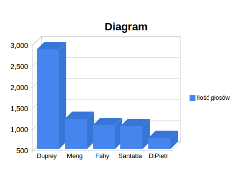

<h1> Map-Reduce <h1>

Baza została pobrana w formacie CSV i została oczyszczona za pomocą google refine. Baze danych pobralem ze strony: http://openstates.org/downloads/ dla miasta NY w USA.
<br/>

<h2> MongoDB - import danych </h2>

Sprawdzenie liczby rekordów:

```sh
C:\mongodb\bin>mongo
MongoDB shell version: 2.4.7
connecting to: test
> use votes
switched to db votes
> db.vote.count()
886182
```

Przykładowy rekord:

```sh
> db.vote.findOne()
{
        "_id" : ObjectId("52b349e1093c8062d690c84d")
        "vote_id" : "NYV00004655",
        "leg_id" : "NYL000025",
        "name" : "Johnson",
        "vote" : "yes"
}
```

<h2>Pierwszy MapReduce</h2>
5 osób które oddało najwięcej pozytywnych głosów.


Funkcja dotycząca imienia i oddanego głosu.
```sh
var mapFunction = function() {
    emit(this.name, this.vote);
};
```

Funkcja zliczająca ilość wystąpień słowa "yes".
```sh
var reduceFunction = function(key, values) {
    var yes = 0;
    for(i in values) {
        if(values[i] === 18) {
            yes++;
        }
    }
    return yes;
};
```

MapReduce:
```sh
var result = db.vote.mapReduce(mapFunction, reduceFunction, {out: {inline: 1}});
```


5 osób które oddały najwięcej pozytywnych głosów:
```sh
> db.map_reduce_example.find().limit(5).sort({value: -1})
{ "_id" : "Duprey", "value" : 2877 }
{ "_id" : "Meng", "value" : 1222 }
{ "_id" : "Fahy", "value" : 1074 }
{ "_id" : "Santaba", "value" : 1046 }
{ "_id" : "DiPietr", "value" : 762 }
```





