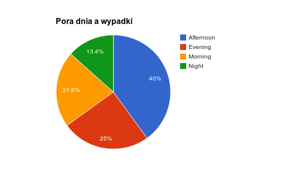
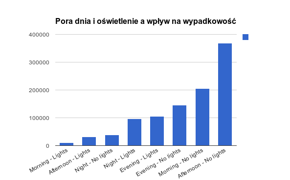

# Wypadki drogowe #

###Mateusz Szygenda###


## Spis treści ##
1. [Dane](#dane)
2. [Transformacje danych](#transformacje-danych)
3. [MongoDB](#mongodb)
 1. [Import](#import-w-mongo)
4. [MapReduce](#map-reduce)
 1. [Opis agregacji](#map-reduce)
 1. [Funkcje pomocnicze](#funkcje-pomocnicze)
 1. [Funkcja map](#map)
 1. [Funkcja reduce](#reduce)
 1. [Wynik](#wynik)
 1. [Wykresy](#wykresy)

# Dane #

Dane wykorzystane do zadania to informacje o wypadkach drogowych w USA pochodzących ze strony (http://data.gov.uk/dataset/road-accidents-safety-data)

Plik wykorzystany do zadania (Accidents7904) zawiera ~6 milionów rekordów. Ze względu na ograniczenia sprzętowe zaimportowany został tylko pierwszy milion rekordów.

Przykładowy rekord:

```
197901A11AD14,,,,,1,3,2,1,18/01/1979,5,08:00,11,9999,3,4,1,30,1,4,-1,-1,-1,-1,1,8,1,-1,0,-1,-1
```
Wygląda on dość kryptycznie jednak poszczególne liczby kodują informację o:

 - Ilości ofiar
 - Dacie wypadku
 - Porze dnia
 - Warunkach atmosferycznych
 - Dniu tygodnia
 - Obecności policji
 - Oświetleniu drogi
 - Stanie nawierzchni
 - Skrzyżowaniu
 - Lokalizacji
 - Ograniczeniu prędkości
 - Numerach dróg na których miało miejsce zdarzenie


# Transformacje danych #

Dane zostały zaimportowane do openrefine w 2 porcjach po 500 000 rekordów. Dla każdej porcji zostały wykonane następujące kroki:

####Kolumna Weather-Conditions została przetransformowana w następujący sposób####

Dane o warunkach pogodowych były zapisane w postaci liczb których znaczenie podane jest w odpowiednim dokumencie. Dla uproszczenia zostały one przetransformowane do napisów

```
if(value == "8", "Unknown",  
if(value == "-1", "Unknown", 
if(value == "7", "Fog", 
if(value == "6", "Snow,Wind", 
if(value == "5", "Rain,Wind", 
if(value == "4", "Fine,Wind", 
if(value == "3", "Snow", 
if(value == "2", "Rain", 
if(value == "1", "Fine", "Unknown"
)))))))))
```

####Kolumna Weather_Condition została rozdzielona na dwie####

Weather condition zawierała informacje o opadach jak i o obecności wiatru. By móc rozróżnić te dwie rzeczy kolumna została rozdzielona na dwie:

Weather i Wind

####Wind została przekształcona do wartości 0, 1####

Po rozdzieleniu kolumny w nowopowstałej kolumnie Wind wartości były postaci "Wind" lub napis pusty. Napisy zostały zamienione na wartości 0, 1:

0 - Oznacza brak wiatru

1 - Oznacza wiatr podczas wypadku

**Transformacja**

 ```
 if(value == "Wind", 1, 0)
 ```

####Kolumna LightsCondition przekształcona####

Ponownie kolumna zawierała liczbowe identyfikatory odpowiednich sytuacji. Wartości jakie przechowywała odpowiadały kolejno "Podczas wypadku był dzień", "Noc z oświetloną drogą", "Noc bez oświetlenia", "Noc" oraz "Noc bez informacji o oświetleniu"

```
   if(value == "1", "Day", 
   if(value == "4", "Night,1", 
   if(value == "5", "Night", 
   if(value == "6", "Night", 
   if(value == "7", "Night", "Unknown")))))
```

####Następnie LightsCondition została ona rozdzielona####

Jako, że LigthsCondition zawierała w sobie 2 informacje (Porę dnia jak i informację o oświetleniu) została ona rozdzielona na dwie kolumny:

 TimeOfDay i LightsPresent

8. Kolumny zawierające liczby zamienione na taki właśnie typ

####Kolumny Date i Time połączone w jedną####

Wykorzystana została do tego następująca transformacja

```
value + " " + row.cells["Time"].value
```

####Typ nowego pole z datą został zamieniony z napisu na typ "Data"####

####Kolumna Time została usunięta####

####Wartości kolumny DayOfWeek zostały przesunięte o 1 do tyłu####
 
 W danych wejściowych dni tygodnia liczone były zaczynając od niedzieli. W wyniku transformacji poniedziałek stał się pierwszym dniem tygodnia.

**Transformacja**
```
if(value == 1, 7, value - 1)
```

####Pozostałe transformacje####
Poza wymienionymi krokami zostały usunięte mało znaczące kolumny i pozmieniane nazwy. Dokładna lista kroków wyeksportowana z openrefine znajduje się [tutaj](../data/mszygenda/open-refine-steps.json)

####Eksport####
Dane zostały wyeksportowane z powrotem do formatu csv.

####Przykładowe rekordy po transformacjach#####

```
{
	"_id" : ObjectId("52a472d10ef5171b420be52f"),
	"Accident_Index" : "197901A7PGV47",
	"PoliceForce" : 1,
	"AccidentSeverity" : 2,
	"NumberOfVehicles" : 1,
	"NumberOfCasualties" : 1,
	"Date" : "1979-07-01T15:30:00Z",
	"DayOfWeek" : 7,
	"RoadType" : 6,
	"SpeedLimit" : 30,
	"TimeOfDay" : "Day",
	"LightsPresent" : 0,
	"Weather" : "Rain",
	"Wind" : 0,
	"Road_Surface_Conditions" : 2,
	"Special_Conditions_at_Site" : -1,
	"Carriageway_Hazards" : 0,
	"Urban_or_Rural_Area" : -1,
	"Did_Police_Officer_Attend_Scene_of_Accident" : -1,
	"LSOA_of_Accident_Location" : ""
}
{
	"_id" : ObjectId("52a472d10ef5171b420be531"),
	"Accident_Index" : "197901A7PKE99",
	"PoliceForce" : 1,
	"AccidentSeverity" : 3,
	"NumberOfVehicles" : 1,
	"NumberOfCasualties" : 1,
	"Date" : "1979-07-01T15:50:00Z",
	"DayOfWeek" : 7,
	"RoadType" : 9,
	"SpeedLimit" : 30,
	"TimeOfDay" : "Day",
	"LightsPresent" : 0,
	"Weather" : "Rain",
	"Wind" : 0,
	"Road_Surface_Conditions" : 2,
	"Special_Conditions_at_Site" : -1,
	"Carriageway_Hazards" : 0,
	"Urban_or_Rural_Area" : -1,
	"Did_Police_Officer_Attend_Scene_of_Accident" : -1,
	"LSOA_of_Accident_Location" : ""
}
```

# MongoDB #

##Import w Mongo##

Dane zostały zaimportowane do MongoDB następującymi poleceniami

```
time mongoimport --headerline --collection accidents --type csv Accidents7904-csv.csv --drop --db nosql

2013-12-08T14:20:51.035+0100 imported 500000 objects

real  0m24.568s
user  0m10.529s
sys 0m0.764s
```

```
time mongoimport --headerline --collection accidents --type csv Accidents7904-csv-part2.csv --db nosql
```

#Map Reduce#

Związek między oświetleniem/porą dnia a wypadkami.

Informację o porze dnia zawiera kolumna "TimeOfDay". Niestety obejmuje ona tylko dwie pory dnia "Day" i "Night". Dodatkowo dla niektórych rekordów jest nieokreślona ("Unknown"). Można jednak dość precyzyjnie określić porę dnia z wykorzystaniem pola "Date".

Wprowadzone zostaną 4 pory dnia "Night", "Morning", "Afternoon" oraz "Evening". Do każdej z nich zostanie włączona informacja o oświetleniu. Tak powstały klucz będzie służył za podstawę do zliczenia ilości wypadków które odbyły się za dnia, nocy itd.

Do wykonania agregacji został wykonany odpowiedni skrypt ([mapReduce.js](../scripts/mszygenda/mapReduce.js))

##Funkcje pomocnicze##

Funkcja obliczająca porę dnia:

```
function getTimeOfDay (record) {
  var date = new Date(record.Date);
  var hour = date.getHours();

  if (hour >= 0 && hour <= 5) {
    return "Night";
  } else if (hour >= 6 && hour <= 12) {
    return "Morning";
  } else if (hour >= 13 && hour <= 18) {
    return "Afternoon";
  } else {
    return "Evening";
  }
}
```

Funkcja transformująca pole "LightsPresent" do napisu

```
function getLightsInfo (record) {
  if (record.LightsPresent == 1) {
    return "WithLightsOn";
  } else {
    return "WithLightsOff";
  }
}
```

Funkcja obliczająca klucz w funkcji map

```
var getMapKey = function (record) {
  return getTimeOfDay(record) + getLightsInfo(record);
}
```

##Map##

Funkcja map dla każdego rekordu emituje dwa klucze. Pierwszy z nich zawiera informację o porze dnia i oświetleniu, natomiast drugi zawiera wyłącznie informację o porze dnia.

```
function map () {
  emit(getMapKey(this), 1);
  emit(getTimeOfDay(this) + "Total", 1);
}
```

##Reduce##

Dla każdego klucza wartości są sumowane

```
function reduce (k, vals) {
  return Array.sum(vals);
}
```

##Wynik##

```
$ mongo nosql scripts/mszygenda/mapReduce.js --quiet
AfternoonTotal,399989
AfternoonWithLightsOff,369101
AfternoonWithLightsOn,30888
EveningTotal,250229
EveningWithLightsOff,145256
EveningWithLightsOn,104973
MorningTotal,216084
MorningWithLightsOff,205625
MorningWithLightsOn,10459
NightTotal,133698
NightWithLightsOff,37732
NightWithLightsOn,95966
```

##Wykresy##

**Diagram kołowy uwzględniający samą porę dnia**



**Wykres słupkowy uwzględniający również oświetlenie**




**Wnioski**

Jak widać na wykresach najwięcej wypadków zdarza się w godzinach popołudniowych. Drugą najczęstszą porą dnia są wieczory. Jak słusznie można było przypuszczać brak oświetlenia ma negatywny wpływ na bezpieczeństwo na drogach.
